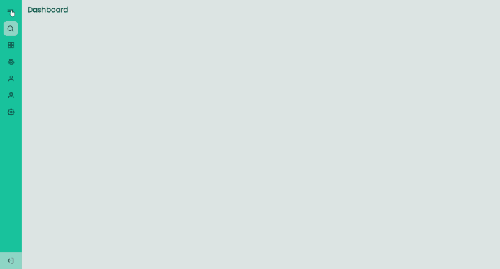

# Sidebar

Esse projeto é um uma sidebar que quando o usuário clicar no ícone do menu ela abre mostrando ícones e texto e quando clicado de novo ele fecha mostrando apenas os ícones.
 
 

## 🚀 Tecnologias

Esse projeto foi desenvolvido com as seguintes tecnologias:

- EJS
- CSS
- JavaScript

 
 

## Tela

 
 

---

Feito por Jackson Gravino
